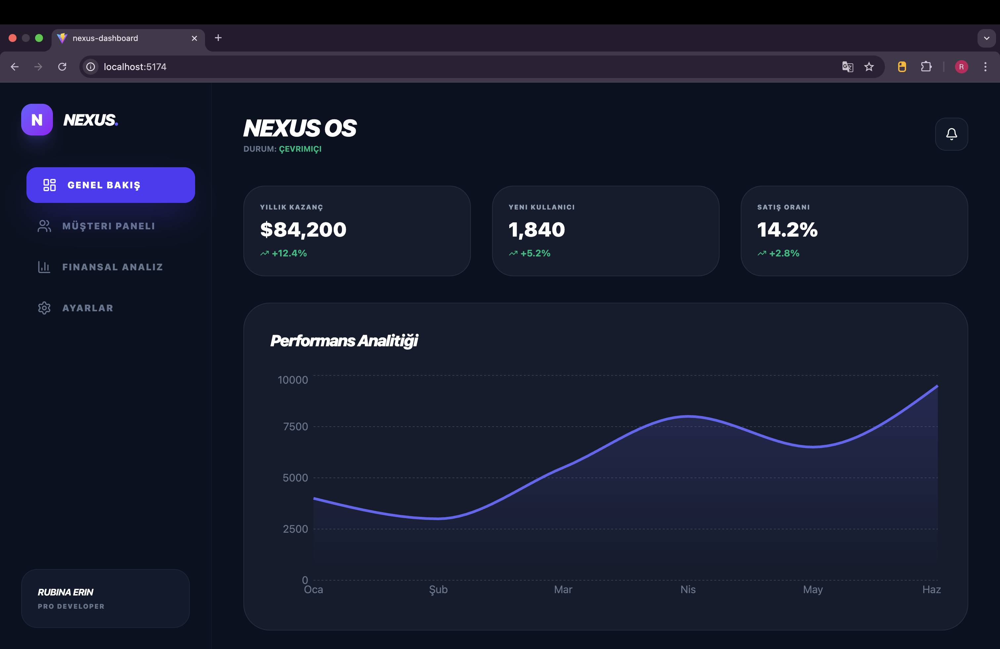
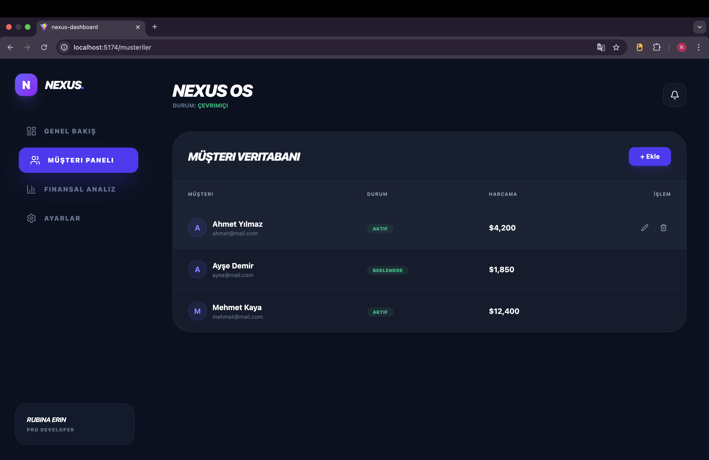
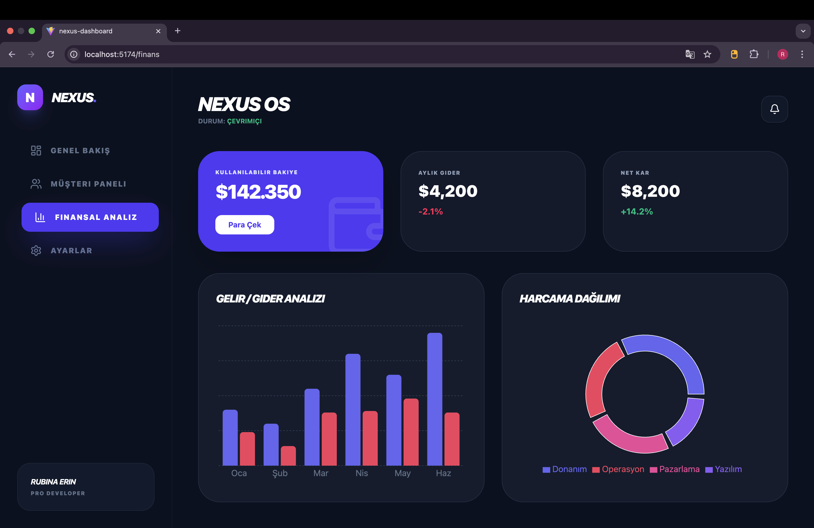
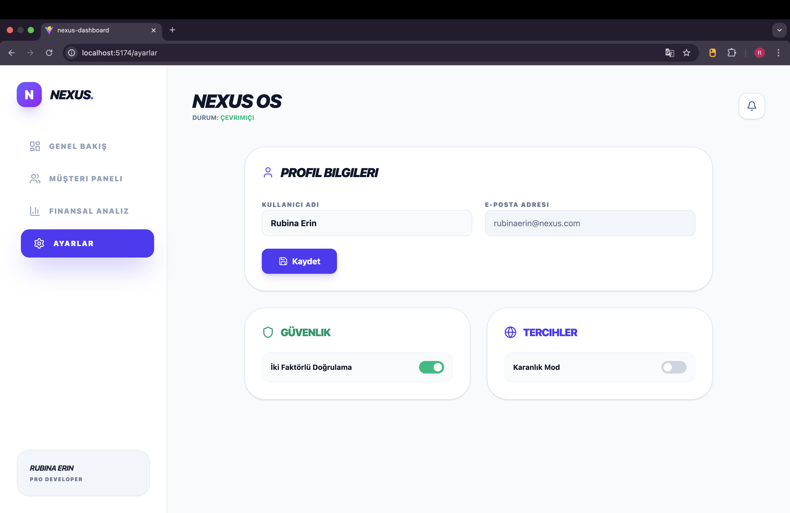

# 🚀 Nexus OS: Next-Gen SaaS Management Dashboard

Nexus OS is a high-performance, modern, and interactive admin dashboard built with **React 18** and **Tailwind CSS**. It provides businesses with a seamless interface to track financial data, manage customers, and monitor system performance in real-time.

## ✨ Key Features

- **🌓 Dynamic Theme Engine:** Toggle between a premium Dark Mode and a clean Light Mode instantly via the settings panel.
- **📊 Advanced Data Visualization:** Interactive Area, Bar, and Pie charts powered by **Recharts** for deep financial analysis.
- **👥 Customer Management (CRUD):** Fully functional interface to add, edit, and delete customer records with state management.
- **💰 Financial Intelligence:** Real-time balance tracking, revenue/expense comparisons, and simulated withdrawal systems.
- **🛡️ Security & Settings:** User profile management with integrated Two-Factor Authentication (2FA) toggles.
- **📱 Responsive & Animated:** Built with a "mobile-first" approach and smooth transitions using Tailwind's animation utility.

## 📸 Screenshots

### 🌑 Dark Mode Overview


### 👥 Customer Management


### 📈 Financial Analytics


### ⚙️ System Settings (Light Mode)


## 🛠️ Tech Stack

- **Framework:** React 18
- **Build Tool:** Vite
- **Styling:** Tailwind CSS
- **Icons:** Lucide-React
- **Charts:** Recharts
- **Routing:** React Router Dom

## 🚀 Getting Started

1. **Clone the repository:**
```bash
  git clone [https://github.com/YOUR_USERNAME/nexus-dashboard.git](https://github.com/YOUR_USERNAME/nexus-dashboard.git)
```
```bash
   npm install
```
  ```bash
   npm run dev
```
   ```bash
   npm run build
```


To make the images appear inside your README on GitHub, follow these steps:

1.  **Create an Assets Folder:** In your project folder (`nexus-dashboard`), create a new folder named `assets`.
2.  **Rename your Screenshots:** Give your files simple names (e.g., rename *Ekran Resmi 2026-01-21 22.56.39.png* to `dashboard-dark.png`).
3.  **Move the Images:** Put all the screenshots inside the `assets` folder.
4.  **Upload to GitHub:**
    * `git add assets/`
    * `git commit -m "docs: add screenshots for README"`
    * `git push origin main`
5.  **The Link Logic:** In the README code I gave you, notice the line: ``. This tells GitHub to look into the assets folder and display that specific image.

### How it will look:
* **Text:** Your titles and descriptions will be bold and clean.
* **Images:** They will appear directly under the "Screenshots" heading, allowing employers to see your work without having to run the code.
* **Icons:** The emojis (🚀, 📊, 🌓) add a "SaaS product" feel to the documentation.

**Would you like me to help you set up a Vercel account so you can also add a "Live Demo" link to this README?** That is usually the final step to make it 100% professional.
